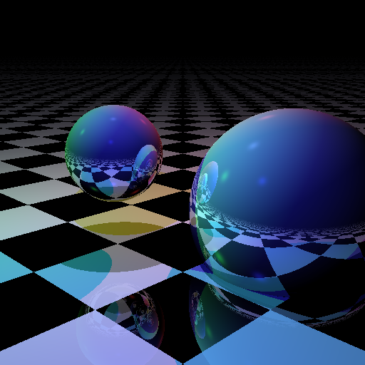

# rust-tracerayer

A toy Rust ray tracer in a single file.

## Resources

This was highly inspired by the work these brilliant folks have put out:

- [ruuda/convector](https://github.com/ruuda/convector) - Non-spectral ray tracer with performance in mind.
- [ruuda/robigo](https://github.com/ruuda/robigo-luculenta) - Spectral ray tracer.
- [gyng/rust-raytracer](https://github.com/gyng/rust-raytracer) - http://gyng.github.io/rust-raytracer-gallery/
- [Twinklebear/tray\_rust](https://github.com/Twinklebear/tray_rust) - Adopts some Physically Based Rendering techniques.
- [lukehoban/rust-raytracer](https://github.com/lukehoban/rust-raytracer/blob/master/src/main.rs) - Another single-file raytracer.
- [gz/rust-raytracer](https://github.com/gz/rust-raytracer) - Several raytracers with increasing complexity.
- [kylc/raytracer](https://github.com/kylc/raytracer) - Another one, lots of modules.

## License

BSD
